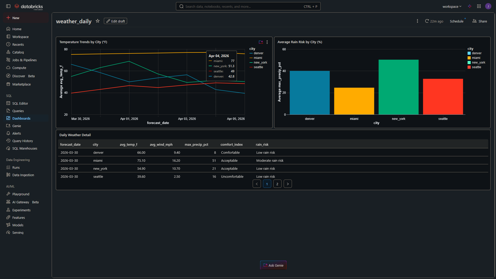

# NOAA Weather Data Pipeline — Databricks Medallion Architecture



> An end-to-end data engineering pipeline ingesting live weather forecast data from the NOAA public API, transforming it through a Medallion Architecture (Bronze → Silver → Gold), and serving it via a Databricks SQL dashboard. Built on Databricks Serverless Compute with managed Delta tables throughout.

---

## Table of Contents

- [Project Overview](#project-overview)
- [Architecture](#architecture)
- [Tech Stack](#tech-stack)
- [Pipeline Layers](#pipeline-layers)
- [Key Engineering Decisions](#key-engineering-decisions)
- [Lessons Learned](#lessons-learned)
- [Dashboard](#dashboard)
- [How to Run](#how-to-run)
- [Project Structure](#project-structure)
- [Future Enhancements](#future-enhancements)

---

## Project Overview

This project demonstrates a production-style data pipeline built on Databricks, ingesting real hourly weather forecast data from the [NOAA Weather API](https://api.weather.gov) for four US cities — New York, Miami, Denver, and Seattle.

The pipeline follows the **Medallion Architecture** pattern:

| Layer | Table | Rows | Description |
|-------|-------|------|-------------|
| Bronze | `weather_bronze_raw` | 4 | Raw JSON payloads, one per city per run |
| Silver | `weather_silver_clean` | 624 | Parsed, typed, flattened hourly forecasts |
| Gold | `weather_gold_daily` | 28 | Daily aggregated metrics per city |
| Serving | `weather_analytics` (view) | 28 | Enriched view with derived business metrics |

---

## Architecture

```
NOAA Weather API (api.weather.gov)
         │
         ▼
┌─────────────────────────────────────────────────────┐
│                  Databricks Serverless               │
│                                                     │
│  ┌──────────┐   ┌──────────┐   ┌──────────┐        │
│  │  Bronze  │──▶│  Silver  │──▶│   Gold   │        │
│  │  Delta   │   │  Delta   │   │  Delta   │        │
│  │  Table   │   │  Table   │   │  Table   │        │
│  └──────────┘   └──────────┘   └──────────┘        │
│                                      │              │
│                               ┌──────▼──────┐      │
│                               │   SQL View  │      │
│                               │  (Serving)  │      │
│                               └──────┬──────┘      │
└──────────────────────────────────────┼─────────────┘
                                       │
                                       ▼
                            Databricks Dashboard
                         (Temperature, Rain Risk, Detail)
```

**All storage layers use managed Delta tables via Unity Catalog** — no raw file paths, no DBFS. This is the modern Databricks pattern and intentionally different from older tutorials that use DBFS for Bronze.

---

## Tech Stack

| Component | Technology |
|-----------|-----------|
| Compute | Databricks Serverless |
| Storage | Managed Delta Lake (Unity Catalog) |
| Transformation | PySpark + Spark SQL |
| Orchestration | Databricks Workflows |
| Serving | Databricks SQL Views + Dashboards |
| Source | NOAA Weather API (free, no auth required) |
| Language | Python 3, SQL |

---

## Pipeline Layers

### Bronze — Raw Ingestion (`01_bronze_ingest.py`)

Fetches raw JSON from the NOAA API for each city and writes it directly to a managed Delta table. No transformations — the raw payload is preserved exactly as received.

```python
# Key pattern: saveAsTable() over raw file paths
df.write.format("delta").mode("append").saveAsTable("weather_bronze_raw")
```

**Why managed tables over DBFS file paths:**
Databricks Serverless has DBFS root access disabled by design as part of the platform's migration to Unity Catalog. More importantly, managed Delta tables are the correct modern pattern regardless — Delta's built-in time travel provides the same "raw copy" safety net that DBFS files used to serve, but with the added benefit of being queryable and governed from day one.

**Schema stored at Bronze:**

| Column | Type | Description |
|--------|------|-------------|
| city | string | City identifier |
| ingestion_ts | string | UTC timestamp of ingest run |
| raw_payload | string | Full NOAA JSON response |
| source_url | string | API source |
| schema_version | string | API version tag |

---

### Silver — Parse and Cleanse (`02_silver_transform.py`)

Parses the nested JSON, explodes the hourly periods array, enforces an explicit schema, deduplicates on natural key, and drops rows with null critical fields.

```python
# Key pattern: explicit StructType over RDD-based inference
payload_schema = StructType([
    StructField("properties", StructType([
        StructField("periods", ArrayType(period_schema))
    ]))
])
```

**Why explicit StructType over RDD schema inference:**
Databricks Serverless blocks RDD operations entirely — they bypass the Catalyst query optimiser and require low-level JVM resource management that conflicts with serverless infrastructure management. Beyond the serverless restriction, explicit schemas are better practice: they document the expected contract with the source API, fail loudly if the API changes structure, and allow Catalyst to fully optimise the execution plan.

**Schema stored at Silver:**

| Column | Type | Description |
|--------|------|-------------|
| city | string | City identifier |
| ingestion_ts | timestamp | Ingest timestamp |
| forecast_time | timestamp | Forecast period start |
| temperature_f | integer | Temperature in Fahrenheit |
| wind_speed_mph | integer | Wind speed (parsed from "10 mph" string) |
| wind_direction | string | Cardinal direction |
| forecast_description | string | Short forecast text |
| precip_probability_pct | integer | Precipitation probability % |
| is_daytime | boolean | Day or night period |

**Deduplication strategy:**
```python
deduped_df = clean_df.dropDuplicates(["city", "forecast_time"])
```
Merging on the natural key (city + forecast_time) ensures idempotent re-runs — running the pipeline twice in one day does not double-count records.

---

### Gold — Business Aggregations (`03_gold_aggregate.py`)

Aggregates Silver data to daily granularity per city, adding derived business metrics including temperature range, comfort index category, and rain risk classification.

```python
gold_df = silver_df.groupBy("city", "forecast_date").agg(
    F.round(F.avg("temperature_f"), 1).alias("avg_temp_f"),
    F.max("temperature_f").alias("max_temp_f"),
    F.min("temperature_f").alias("min_temp_f"),
    F.round(F.max("temperature_f") - F.min("temperature_f"), 1).alias("temp_range_f"),
    F.round(F.avg("wind_speed_mph"), 1).alias("avg_wind_mph"),
    F.round(F.avg("precip_probability_pct"), 1).alias("avg_precip_pct"),
    F.max("precip_probability_pct").alias("max_precip_pct"),
    F.first("forecast_description").alias("primary_condition"),
    F.count("*").alias("hourly_periods_count")
)
```

**Schema stored at Gold:**

| Column | Type | Description |
|--------|------|-------------|
| city | string | City identifier |
| forecast_date | date | Forecast date |
| avg_temp_f | double | Daily average temperature |
| max_temp_f | integer | Daily high |
| min_temp_f | integer | Daily low |
| temp_range_f | double | Daily temperature swing |
| avg_wind_mph | double | Average wind speed |
| max_wind_mph | integer | Peak wind speed |
| avg_precip_pct | double | Average precipitation probability |
| max_precip_pct | integer | Peak precipitation probability |
| temp_category | string | Hot / Warm / Mild / Cold / Freezing |

---

### Serving — SQL View (`04_serving_layer.sql`)

A SQL view on top of the Gold table that adds derived analytical fields without duplicating storage. Analysts query this view directly — they never need to know the underlying Delta table structure.

```sql
CREATE OR REPLACE VIEW weather_analytics AS
SELECT *,
    CASE
        WHEN max_precip_pct >= 70 THEN 'High rain risk'
        WHEN max_precip_pct >= 40 THEN 'Moderate rain risk'
        ELSE 'Low rain risk'
    END AS rain_risk,
    CASE
        WHEN avg_temp_f >= 65 AND avg_wind_mph <= 15 THEN 'Comfortable'
        WHEN avg_temp_f >= 50 AND avg_wind_mph <= 20 THEN 'Acceptable'
        ELSE 'Uncomfortable'
    END AS comfort_index
FROM weather_gold_daily;
```

**Why a view over a table for serving:**
Views decouple the analytics contract from the storage layout. If the Gold table structure changes, only the view definition needs updating — not every downstream query or dashboard.

---

## Key Engineering Decisions

### 1. Managed Delta tables all the way from ingestion to serving

Unlike tutorials that use DBFS files for Bronze and tables for Silver, this pipeline uses managed Delta tables at every layer. The reasoning:

- Delta's **time travel** (`VERSION AS OF`) provides the same "raw copy" safety net as storing files
- Unity Catalog provides **governance and lineage** out of the box
- **No file path management** — Databricks handles physical storage location transparently
- This is the direction Databricks is pushing the platform — serverless enforces it as a hard rule

### 2. Explicit StructType schema definition

RDD-based schema inference is blocked on serverless and is an antipattern even on dedicated clusters. Explicit schemas:

- Document the source API contract in code
- Allow Catalyst to optimise without needing to scan data first
- Fail loudly on API schema changes rather than silently miscasting types

### 3. Catalyst optimiser — why DataFrames beat RDDs

Spark's Catalyst optimiser rewrites DataFrame operations into the most efficient execution plan before running. It applies predicate pushdown (filtering early), column pruning (dropping unused columns before joins), and chooses join strategies automatically. RDDs bypass Catalyst entirely — they run exactly as written, unoptimised. This is analogous to writing set-based SQL queries vs row-by-row cursors in SQL Server: the declarative approach always wins because it gives the engine freedom to find the best execution path.

### 4. Serverless vs dedicated cluster

This pipeline runs on Databricks Serverless compute rather than a traditional all-purpose cluster. Serverless:

- Starts instantly — no 3-5 minute cluster spin-up
- Requires no cluster configuration or management
- Enforces modern patterns (no DBFS, no RDDs) by design
- Is the default for new Databricks workspaces

The tradeoff: serverless restricts low-level Spark operations (RDDs, DBFS paths). For this pipeline, those restrictions pushed us toward better patterns.

### 5. SFTP and file-based ingestion (extension pattern)

This pipeline ingests from an API — data arrives as HTTP responses in memory, so no file landing zone is needed. For file-based sources like SFTP vendor drops, the pattern extends as follows:

```
SFTP Server
    ↓
Cloud Storage bucket (S3 / ADLS / GCS)   ← always-on landing zone
    ↓
Databricks Auto Loader                    ← watches bucket for new files
    ↓
Bronze Delta table                        ← same managed table pattern
```

Auto Loader supports two modes:
- **File notification mode** (`cloudFiles.useNotifications = true`) — cloud storage pushes an event when a file arrives, near-zero latency
- **Directory listing mode** (`cloudFiles.useNotifications = false`, default) — Auto Loader scans the bucket on a configurable trigger interval

```python
# Directory listing mode with 15-minute trigger
spark.readStream.format("cloudFiles") \
    .option("cloudFiles.format", "json") \
    .option("cloudFiles.useNotifications", "false") \
    .load("s3://your-bucket/landing/") \
    .writeStream \
    .trigger(processingTime="15 minutes") \
    .toTable("weather_bronze_raw")
```

The trigger interval is controlled at the Structured Streaming level, not on Auto Loader itself — a clean separation of ingestion logic from scheduling logic.

---

## Lessons Learned

### DBFS is disabled on Serverless — and that's a good thing
The first two versions of the Bronze notebook used DBFS paths (`/tmp/` then `dbfs:/FileStore/`). Both failed with `[DBFS_DISABLED]`. The fix — `saveAsTable()` — turned out to be the correct modern pattern anyway. The platform's restriction forced better architecture.

### RDDs are the Cursor of Spark
Just as SQL Server cursors force row-by-row processing that bypasses the query optimiser, Spark RDDs bypass Catalyst and run unoptimised. The schema inference code that used RDDs was replaced with explicit `StructType` definitions — which are both serverless-compatible and genuinely better practice. Serverless didn't just restrict a feature; it enforced a 10-year evolution away from MapReduce-style imperative code toward declarative, optimiser-driven data processing.

### Databricks vs Microsoft Fabric storage model
Both platforms use Delta Lake and Parquet under the hood. The difference is visibility: Fabric (built on OneLake / ADLS Gen2) exposes both a files folder and a table at every Medallion layer, because its multi-engine architecture requires the physical file layer to be accessible to Power BI, Spark, and SQL simultaneously. Databricks abstracts the file layer away entirely — you interact only with tables, and Unity Catalog manages physical storage transparently. Neither is wrong — they reflect different platform philosophies.

### The wind speed parsing problem
NOAA returns wind speed as a string — `"10 mph"` — not an integer. This is a real-world data quality issue that `regexp_extract` solved cleanly in Silver:
```python
F.regexp_extract("period.windSpeed", r"(\d+)", 1).cast(IntegerType())
```
Small issues like this are worth documenting — they show the pipeline handles messy real-world data, not just clean sample datasets.

---

## Dashboard

The serving layer is visualised in a Databricks Dashboard with three widgets:

- **Temperature Trends by City (°F)** — line chart showing 7-day temperature forecast per city
- **Average Rain Risk by City (%)** — bar chart comparing precipitation probability across cities
- **Daily Weather Detail** — paginated table with comfort index and rain risk classifications

Key insight from the data: Miami maintains a flat ~75°F with moderate rain risk all week. Seattle sits consistently cold (~40°F) with the highest rain risk. Denver shows the highest temperature volatility — classic Rocky Mountain weather patterns.

---

## How to Run

### Prerequisites
- Databricks Community Edition account (free)
- No API keys required — NOAA API is public

### Setup
1. Create a `weather_pipeline` folder in your Databricks Workspace
2. Import the four notebooks into the folder
3. Ensure Serverless compute is selected (default on new CE accounts)

### Run order
```
01_bronze_ingest.py      → Creates weather_bronze_raw
02_silver_transform.py   → Creates weather_silver_clean
03_gold_aggregate.py     → Creates weather_gold_daily
04_serving_layer.sql     → Creates weather_analytics view
```

### Schedule (optional)
Wire notebooks into a Databricks Workflow job with a daily cron schedule (`0 6 * * *`) to refresh data automatically each morning.

---

## Project Structure

```
weather_pipeline/
├── 01_bronze_ingest.py       # NOAA API fetch → Bronze Delta table
├── 02_silver_transform.py    # JSON parse + cleanse → Silver Delta table
├── 03_gold_aggregate.py      # Daily aggregations → Gold Delta table
├── 04_serving_layer.sql      # SQL view + analytical queries
├── dashboard_preview.png     # Dashboard screenshot
└── README.md                 # This file
```

---

## Future Enhancements

- **Add Snowflake serving layer** — replicate Gold table to Snowflake via Delta Sharing for cross-platform serving (Phase 2)
- **Extend to SFTP ingestion** — add Auto Loader pattern for file-based weather data sources
- **Add data quality checks** — use Delta Live Tables expectations to enforce SLAs on Silver
- **Celsius conversion** — add metric unit support for international audiences
- **Extend city coverage** — add international cities via Open-Meteo API (also free, JSON-native)
- **Streaming ingestion** — replace batch Bronze ingest with Spark Structured Streaming for near-real-time updates

---

*Built with Databricks Community Edition · NOAA Weather API · Delta Lake · PySpark*
